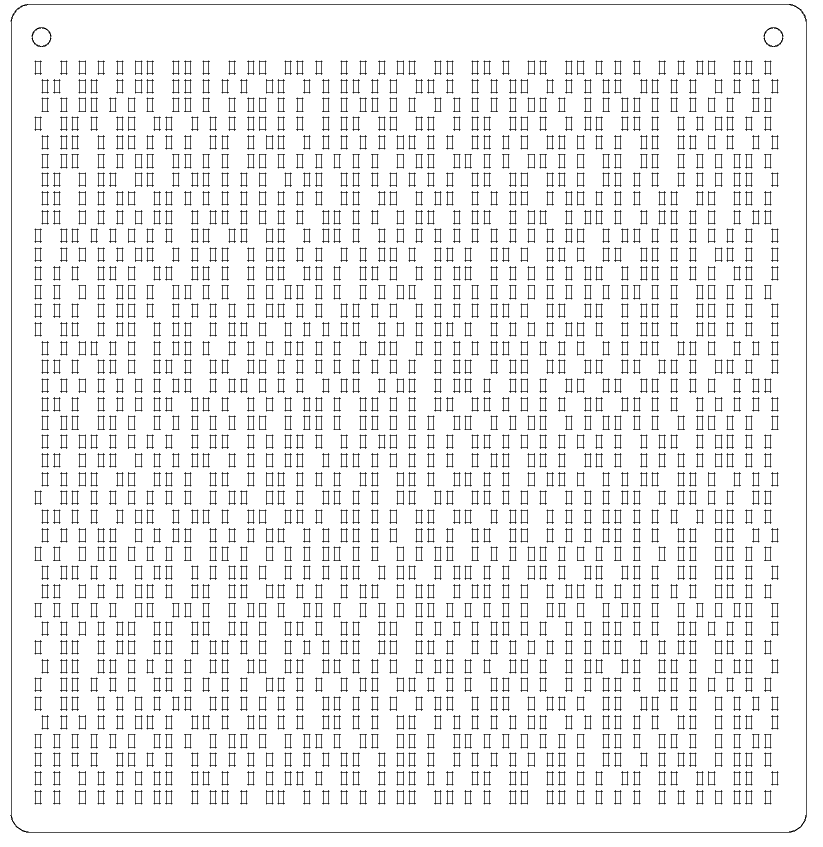
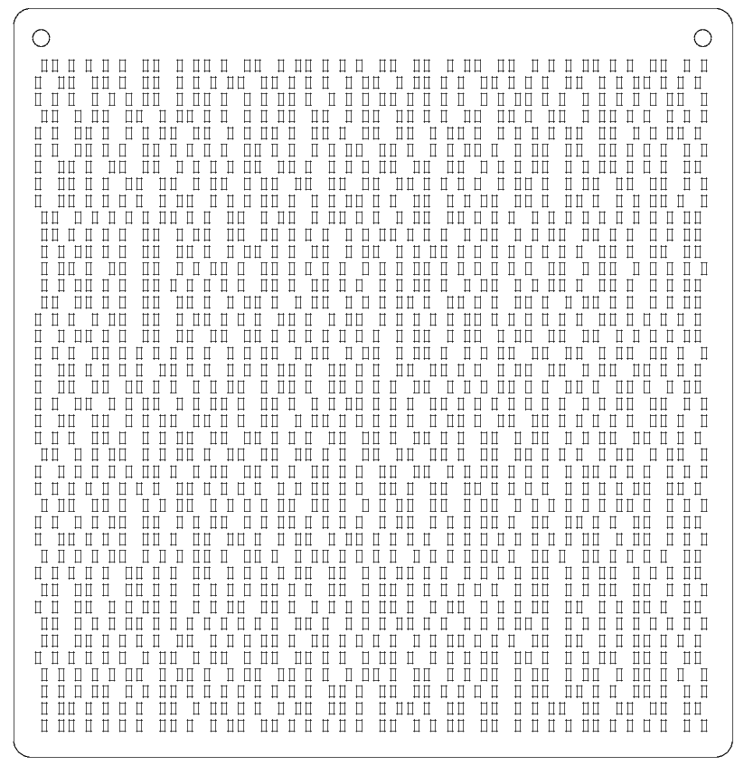
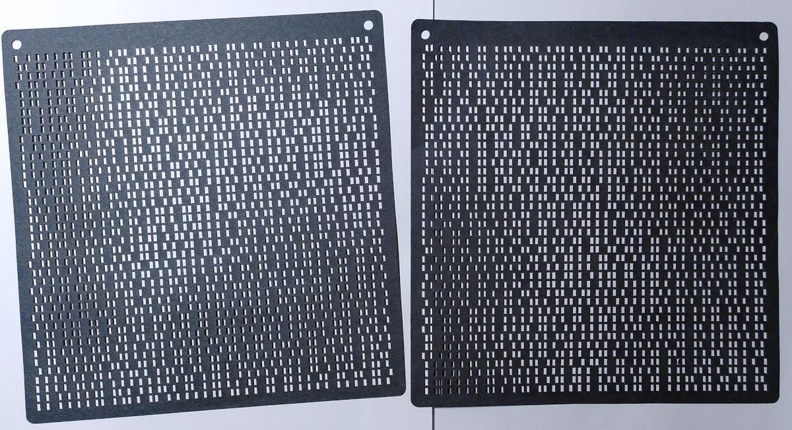
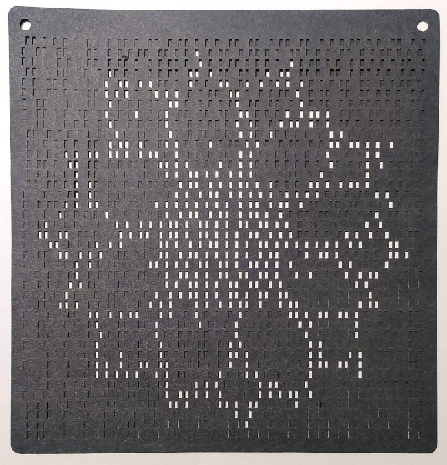

Optical One-Time Pad XOR encoding of images
===========================================

This little tool converts an image into a laser-cuttable pair of vector files.
Cut out on paper/cardboard and overlay. Only combined together they reproduce
the original image.

Only supported image format currently: ppm (raw encoded, `P6`).
(It only looks at the red channel and cuts off at value 128. TODO: this
should support at least PBM (`P4`), but possibly other image formats. And
better thresholding for grayscale/color inputs).

Given a key and an image, this program emits two pages of vector cuts as
PostScript file to stdout (There is a convenient Makefile rule to convert to
DXF).

**_Note, this is a fun demo and just uses srand(); don't use as actual OTP_**
You can make this secure by using a cryptographically sound RNG.

Each optical bit is represented in a square area, in which either the left
or right half is cut out: [█&nbsp;&nbsp;]=0,  [&nbsp;&nbsp;█]=1

If overlayed, cut-outs that overlap let light shine through, while if they
are on opposing blocks, nothing can be seen. So only if both bits are the
same, the overlayed output will let light through, behaving as optical
`XNOR` operation.

For fun applications, you can of course encode multiple images with the
same key and then you need only one key to decode all of them. But of course,
overlaying the various messages can be used to reveal partial images and
key. You can use that as a motivating example teaching why OTPs must only
be used exactly once.

### Build
```
make
```

### Use

Synopsis

```
Usage:
./otp-image <key> <ppm-file>
Reasonable image size is somewhere around <= 60x40px
```

Example

```bash
# Encode image with key "5ecr3t"
./otp-image "5ecr3t" someimage.ppm > my-encoded.ps

# Empty key, key-page is all zeroes, Pictures come out as-is,
./otp-image "" someimage.ppm > my-encoded.ps
```

You can edit the PostScript file (it allows for some parameters to be
tweaked). For ease of laser-cutting, convert to DXF:

```bash
# The following actually creates my-encoded-1.dxf and my-encoded-2.dxf
# for the both pages created
make my-encoded-1.dxf
```

### Example
Here an example of a 40x40 pixel image.
This is how these files look like; they have convenient holes at the top
for aligning. Each of the pages on their own look entirely random:

Key                | Img
-------------------|--------------------
 | 


#### Each cutout


#### Overlay result

